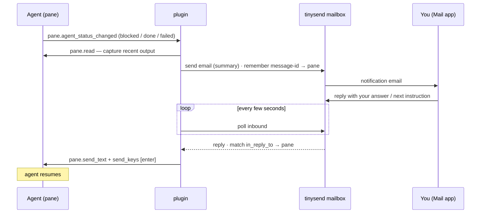

# tinysend → herdr

A [herdr](https://herdr.dev) plugin that emails you when an agent blocks, finishes,
or fails — with a one-line summary of what it's doing — and lets you reply to that
email to drive it: answer a blocked agent, or hand a finished one its next task.
Your phone's Mail app becomes the remote for agents running over SSH. Powered by
[tinysend](https://tinysend.com).

## how it works



The reply comes back by polling the mailbox (the herdr socket is local), so no
inbound webhook or public URL is needed. Each email contains: which session
(space · tab · pane · dir), a summary of what the agent is asking / just did, and
a reply hint.

## get your tinysend credentials

You need three things from [tinysend](https://app.tinysend.com): a mailbox, a key
for it, and your own email address.

1. Create a mailbox — app.tinysend.com/mailboxes → New mailbox. Pick an address
   like `you@tinysend.com` (or your own domain). It sends the alerts and catches
   your replies.
2. `TINYSEND_MAILBOX_ID` — open the mailbox; its id (`mbx_...`) is in the URL.
3. `TINYSEND_KEY` — on the mailbox's Settings tab, generate a mailbox-scoped API
   key (`sk_mbx_...`), shown once. (Scoped to the mailbox, so `from` defaults to it.)
4. `NOTIFY_TO` — your own everyday inbox (Gmail, iCloud) where alerts land and you
   reply from. NOT the tinysend mailbox.

## setup

```sh
herdr plugin install tiny-send/tinysend-herdr
cp .env.example "$(herdr plugin config-dir tinysend.herdr)/.env"   # then edit it
```

`.env`:

```sh
TINYSEND_KEY=sk_mbx_...
TINYSEND_MAILBOX_ID=mbx_...
NOTIFY_TO=you@example.com
NOTIFY_ON=blocked,done,failed
# only email once you've been away this long (idle/locked); 0 = always. macOS only.
NOTIFY_AWAY_AFTER_MINUTES=30
# optional — a real one-line LLM summary instead of a scrollback tail
ANTHROPIC_API_KEY=sk-ant-...
```

Open the reply-watcher pane (keep it running — it's what catches your replies):

```sh
herdr plugin pane open --plugin tinysend.herdr --entrypoint watcher
```

Tip: connect the tinysend mailbox to Apple Mail (one-tap profile) to read and
reply on your phone in the native Mail app.

## away-only notifications

By default you're only emailed once you've been away from the Mac for 30 minutes —
no keyboard/mouse input or the screen is locked — so an agent that blocks while
you're sitting there watching the pane doesn't ping you. Tune or disable it with
`NOTIFY_AWAY_AFTER_MINUTES` (minutes; `0` = always email). Presence is read from
`ioreg` (HID idle time + `CGSSessionScreenIsLocked`); on a non-macOS herdr host it
can't be detected, so it always notifies. Note it's checked at the moment the
status changes — if you walk away later, that already-fired event won't resend.

## mute

```sh
herdr plugin action invoke toggle --plugin tinysend.herdr
```

Bind a key in herdr:

```toml
[[keys.command]]
key = "prefix+shift+t"
type = "plugin_action"
command = "tinysend.herdr.toggle"
```

## notes

- Node 18+. One dependency: the `tinysend` SDK (installed at plugin install).
- The watcher pane must stay running to catch replies. Close it and replies stop.
- Replies work for `blocked` and `done` — answer a blocked agent or give a finished
  one its next instruction; both get typed into the pane.
- The target pane must still exist for the reply to land.
- With no `ANTHROPIC_API_KEY` the summary is a cleaned scrollback tail; with one
  it's a Claude Haiku one-liner (model overridable via `ANTHROPIC_MODEL`).
- Replies match by `In-Reply-To` ↔ `Message-ID`; every send is tagged `channel=herdr`.
