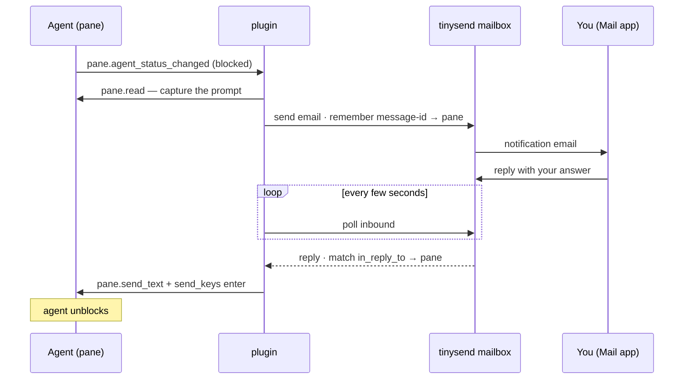

# tinysend → herdr

A [herdr](https://herdr.dev) plugin that emails you when an agent blocks, finishes,
or fails — and lets you reply to that email to type an answer straight into the
blocked agent. Your phone's Mail app becomes the remote control for agents running
over SSH. Powered by [tinysend](https://tinysend.com).

## how it works



The reply comes back by polling the mailbox (the herdr socket is local), so no
inbound webhook or public URL is needed.

## get your tinysend credentials

You need three things from [tinysend](https://app.tinysend.com): a mailbox, a key
for it, and your own email address.

1. Create a mailbox — app.tinysend.com/mailboxes → New mailbox. Pick an address
   like `you@tinysend.com` (or use your own domain). This is the account that
   sends the alerts and catches your replies.
2. Get `TINYSEND_MAILBOX_ID` — open the mailbox; its id (`mbx_...`) is in the URL,
   `app.tinysend.com/mailboxes/<mbx_...>`.
3. Get `TINYSEND_KEY` — on that mailbox's Settings tab, generate a mailbox-scoped
   API key (`sk_mbx_...`). It's shown once; copy it. (Scoped to this mailbox, so
   `from` defaults to it — the plugin only sends `to` + subject + body.)
4. `NOTIFY_TO` is your own everyday inbox (Gmail, iCloud, work email) — where the
   alert lands and the address you reply from. NOT the tinysend mailbox.

`NOTIFY_ON` is just which agent statuses email you (`blocked,done,failed`).

## setup

1. Have your `sk_mbx_...` key, `mbx_...` id, and your inbox address ready (above).
2. Install and configure:

```sh
herdr plugin install tiny-send/tinysend-herdr
cp .env.example "$(herdr plugin config-dir tinysend.herdr)/.env"   # then edit it
```

`.env`:

```sh
TINYSEND_KEY=sk_mbx_...
TINYSEND_MAILBOX_ID=mbx_...
NOTIFY_TO=you@example.com
NOTIFY_ON=blocked,done,failed
```

3. Open the reply-watcher pane once (keep it running):

```sh
herdr plugin pane open --plugin tinysend.herdr --entrypoint watcher
```

Tip: connect the tinysend mailbox to Apple Mail (one-tap profile) and you can read
and reply on your phone in the native Mail app.

## mute

```sh
herdr plugin action invoke toggle --plugin tinysend.herdr
```

Or bind a key in herdr:

```toml
[[keys.command]]
key = "prefix+shift+t"
type = "plugin_action"
command = "tinysend.herdr.toggle"
```

## notes

- Node 18+. One dependency: the `tinysend` SDK (installed at plugin install).
- Sends only on the statuses in `NOTIFY_ON`. Only `blocked` arms a reply-to-unblock.
- Replies match the original by `In-Reply-To` ↔ `Message-ID`; tags every send
  `channel=herdr` so you can filter them in tinysend.
